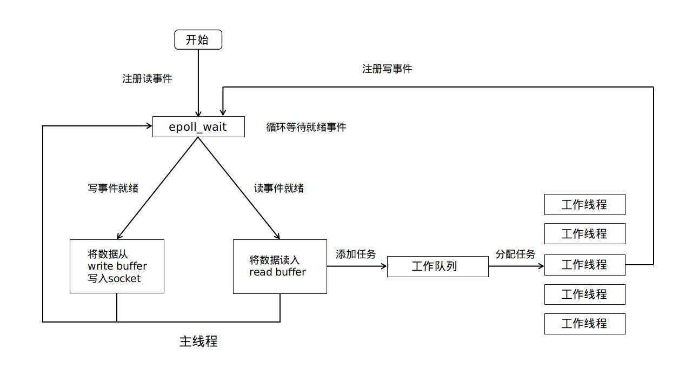

# 基于线程池的Web服务器

## 特点

- 静态Web服务器，支持 `GET` 请求
- 使用半同步/半异步模式的线程池支持对服务器的并发访问
  - 异步模式的主线程使用epoll监听socket上事件
  - 同步模式的工作线程执行HTTP请求解析以及HTTP响应构造
- 基于有限状态自动机对HTTP请求进行解析

## 工作流程



## 使用

将测试使用的静态test.html文件放入 `/var/www/html/` 中

服务器编译与启动：

```
mkdir build
cd build
cmake ..
make
./ThreadPool_SVR 127.0.0.1 8888
```

测试编译与启动：

```
g++ test.cpp -o test
./test 127.0.0.1 8888 10
// 10为并发连接的个数，可设置更多作为压力测试
```

